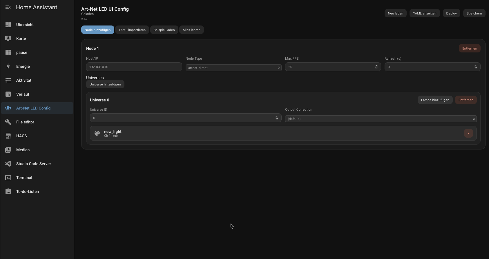
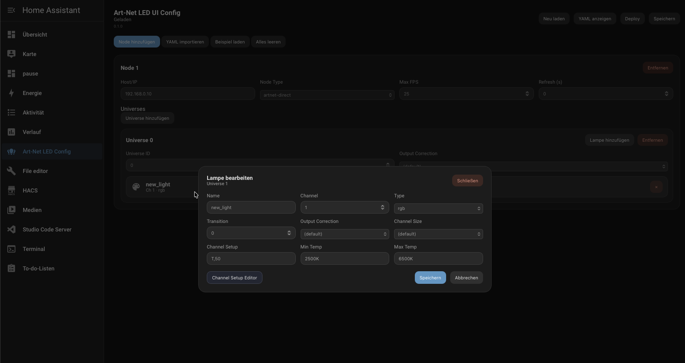
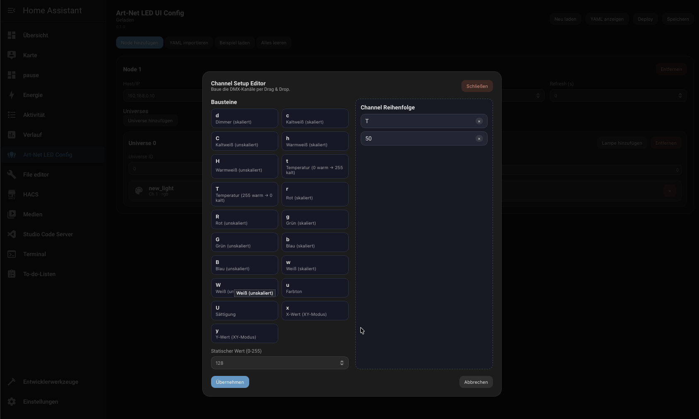

# Art-Net LED UI Config

Custom integration (not listed in official HACS) for a WYSIWYG configuration of https://github.com/Breina/ha-artnet-led. The integration provides a sidebar panel and stores the configuration in Home Assistant storage.

Deutsch: see [README.de.md](README.de.md).

## Screenshots
[](screen1.png)
[](screen2.png)
[](screen3.png)

## Installation (HACS Custom Repository)
1. Open HACS → Integrations → ⋮ → Custom repositories.
2. Add repository URL: https://github.com/speedy3wk/ha-artnet-led-uiconfig (Category: Integration).
3. Install the integration and restart Home Assistant.
4. Add the integration in Settings → Devices & Services.

## Panel
After installation a sidebar panel **Art-Net LED Config** appears.

## Lovelace card (optional)
You can also use it as a Lovelace card. Add the resource:

- URL: `/api/ha_artnet_led_uiconfig/ha-artnet-led-uiconfig.js`
- Type: JavaScript module

Card config:

```yaml
type: ha-artnet-led-uiconfig
```

## Automatic YAML write (Add-on, optional)
This repository includes an add-on under addons/ha_artnet_led_uiconfig. The add-on writes YAML to /config and triggers a reload.

Steps:
1. Add-on Store → ⋮ → Repositories → add https://github.com/speedy3wk/ha-artnet-led-uiconfig.
2. Install the add-on.
3. Start the add-on.
4. In the panel click **Deploy**.

### Add-on defaults (HAOS / Supervisor)
No configuration is required:
- `ha_url`: http://supervisor/core/api
- `ha_token`: empty (Supervisor token is provided automatically)

### If Supervisor token is not available
Use a Long‑Lived Access Token:
- `ha_url`: http://homeassistant:8123
- `ha_token`: Long‑Lived Access Token

How to create a Long‑Lived Access Token:
User Profile → Long‑Lived Access Tokens → Create Token.

The deploy writes `/config/ha_artnet_led_uiconfig.yaml` and adds `light: !include ha_artnet_led_uiconfig.yaml` to configuration.yaml once.

## Installation checklist
- Integration installed and Home Assistant restarted
- Integration added in Settings → Devices & Services
- Add-on installed and started (optional)
- Panel visible: **Art-Net LED Config** in the sidebar

## Deploy test
1. Open the panel and edit the configuration.
2. Press **Deploy**.
3. Verify `/config/ha_artnet_led_uiconfig.yaml` was written.
4. Verify configuration.yaml contains `light: !include ha_artnet_led_uiconfig.yaml`.
5. Check Settings → System → Logs for reload errors.

## Frontend development
In frontend:
- `npm install`
- `npm run build`

Bundle output: custom_components/ha_artnet_led_uiconfig/frontend/dist/.

---
This project is fully AI-generated.
